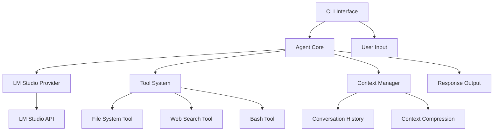

# Архитектура LM Studio Assistant

## Общая архитектура



## Компоненты системы

### 1. CLI Interface
Отвечает за взаимодействие с пользователем:
- Прием команд и запросов
- Отображение ответов с форматированием
- Выбор модели из LM Studio
- Настройки приложения

### 2. Agent Core
Центральный компонент, координирующий работу:
- Обработка пользовательских запросов
- Формирование промптов для модели
- Вызов инструментов на основе ответов модели
- Управление циклом выполнения задач

### 3. LM Studio Provider
Интеграция с LM Studio:
- Подключение к локальному API
- Получение списка доступных моделей
- Отправка запросов к выбранной модели
- Обработка streaming ответов

### 4. Tool System
Набор инструментов для выполнения действий:

#### File System Tool
- `readFile(path)` - чтение файла
- `writeFile(path, content)` - создание/перезапись файла
- `editFile(path, oldContent, newContent)` - редактирование
- `listFiles(directory)` - список файлов
- `createDirectory(path)` - создание папки

#### Web Search Tool
- `search(query)` - поиск в интернете
- `fetchPage(url)` - получение содержимого страницы
- `extractInfo(html, query)` - извлечение информации

#### Bash Tool
- `execute(command)` - выполнение команды
- `checkOutput(command)` - получение вывода
- `runInBackground(command)` - фоновое выполнение

### 5. Context Manager
Управление контекстом диалога:
- Хранение истории сообщений
- Сжатие контекста при превышении лимита
- Приоритизация важной информации
- Кеширование результатов инструментов

## Поток данных

1. **Пользовательский ввод** → CLI Interface
2. **Формирование запроса** → Agent Core добавляет:
   - Системный промпт
   - Доступные инструменты
   - Контекст из истории
3. **Запрос к модели** → LM Studio Provider
4. **Анализ ответа** → Agent Core определяет:
   - Нужно ли вызвать инструмент
   - Какой инструмент вызвать
   - С какими параметрами
5. **Выполнение инструмента** → Tool System
6. **Обработка результата** → Agent Core
7. **Повторение цикла** если нужно
8. **Финальный ответ** → CLI Interface → Пользователь

## Форматы взаимодействия

### Формат запроса к модели
```typescript
interface ModelRequest {
  messages: Message[];
  tools: ToolDefinition[];
  temperature: number;
  max_tokens: number;
}

interface Message {
  role: 'system' | 'user' | 'assistant' | 'tool';
  content: string;
  tool_calls?: ToolCall[];
  tool_call_id?: string;
}
```

### Формат определения инструментов
```typescript
interface ToolDefinition {
  name: string;
  description: string;
  parameters: {
    type: 'object';
    properties: Record<string, any>;
    required: string[];
  };
}
```

### Пример промпта с инструментами
```xml
<system>
You are a helpful AI assistant with access to tools.

Available tools:
<tools>
<tool name="readFile">
  <description>Read contents of a file</description>
  <parameters>
    <path type="string" required="true">File path to read</path>
  </parameters>
</tool>
<tool name="writeFile">
  <description>Write content to a file</description>
  <parameters>
    <path type="string" required="true">File path to write</path>
    <content type="string" required="true">Content to write</content>
  </parameters>
</tool>
</tools>

When you need to use a tool, respond with:
<tool_use>
<tool_name>toolName</tool_name>
<parameters>
  <param_name>value</param_name>
</parameters>
</tool_use>
</system>
```

## Обработка ошибок

### Уровни ошибок
1. **Критические** - прерывают выполнение
   - Недоступность LM Studio
   - Отсутствие моделей
   
2. **Восстанавливаемые** - повторная попытка
   - Timeout запроса
   - Неверный формат ответа
   
3. **Предупреждения** - продолжение работы
   - Файл не найден
   - Нет доступа к интернету

### Стратегии восстановления
- Retry с exponential backoff
- Fallback на упрощенные промпты
- Кеширование успешных результатов
- Graceful degradation функциональности